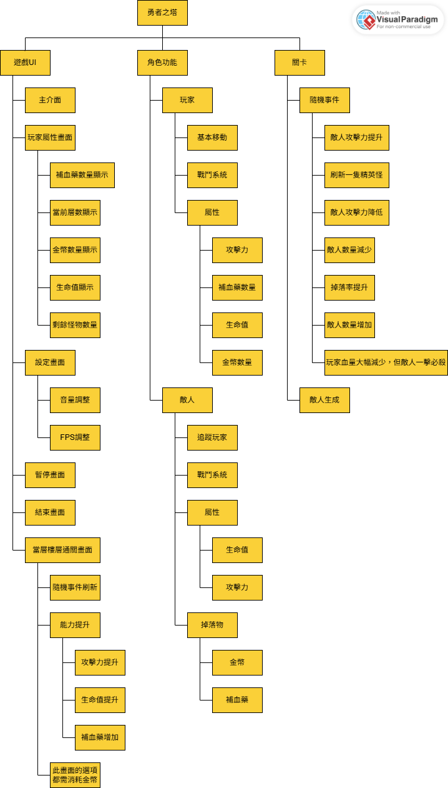
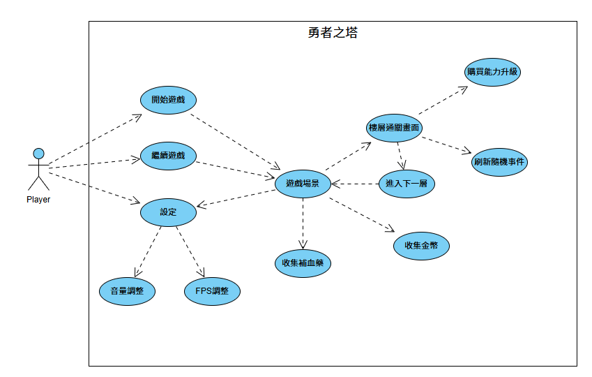

## 遊戲介紹

>玩家將進入勇者之塔，塔內每層都會有許多怪物阻擋玩家前進，且每層都會有隨機事件，讓玩法較具多樣性，死亡將會從零開始。
---
## 功能性需求
### 1. 玩家核心系統 
* **玩家控制**：玩家必須有基本的攻擊動作及移動方式。
* **玩家屬性**：玩家角色必須具備可量化的屬性，至少包含：
    * 當前生命值 (Current HP)
    * 最大生命值 (Max HP)
    * 攻擊力 (Attack Power)
    * 金幣持有量 (Gold)
* **生命週期**：當玩家生命值降至0時，遊戲結束，回到主畫面。

### 2. 遊戲循環系統 
* **房間進入/生成**：系統必須能在玩家進入下一層時，生成一個新的房間。
* **怪物生成**：系統必須在房間生成時，根據特定規則（如樓層數）配置複數的怪物。
* **戰鬥結算**：系統必須能夠判定房間內所有怪物是否已被擊殺。
* **金幣掉落**：怪物被擊殺時，必須掉落金幣，並允許玩家拾取以增加金幣持有量。
* **決策階段觸發**：當房間通關後，進入「決策介面」。

### 3. 決策與升級系統 
* **事件抽取**：進入決策介面時，系統必須從「事件池」中隨機抽取一個事件並向玩家展示。
* **事件刷新**：玩家必須能夠花費金幣來「刷新」當前事件。
    * 刷新功能必須有對應的按鈕。
    * 每次刷新的金幣成本必須是遞增的。
* **能力升級商店**：決策介面中必須展示一個可供購買的升級列表（如提升生命、攻擊力）。
    * 每項升級必須有明確的金幣價格。
    * 玩家點擊購買後，系統必須扣除相應金幣，並提升玩家對應的屬性。
* **流程推進**：玩家完成決策後，必須有一個明確的按鈕或機制，讓玩家能前往下一層。

### 4. 內容與隨機化系統 
* **房間多樣性**：系統必須至少有三種不同的房間樣式，並在生成時隨機選用。
* **怪物多樣性**：遊戲中必須存在至少數種類型的怪物，牠們在行為或屬性上應有區別。
* **事件池**：必須有一個包含多種事件（正面、負面、中性）

### 5. 使用者介面
* **遊戲開始畫面**：顯示遊戲開始、繼續遊戲、設定按鈕。
* **遊戲主介面**：遊戲時，必須清晰顯示玩家的生命值、金幣數量、當前樓層等資訊。
* **決策介面**：清晰展示抽到的事件描述、刷新按鈕及所需費用、可購買的升級選項及價格。
* **遊戲結束介面**：玩家死亡時，必須顯示一個結算畫面，告知本次挑戰的最終成績（如達到的樓層數）。
---
## 非功能性需求
### 1. 效能
* **流暢度**：遊戲必須能以穩定的幀率運行，不能出現明顯的卡頓。
* **載入時間**：從決策階段進入下一個房間的載入時間應該盡可能短，保持遊戲節奏。

### 2. 可用性
* **直觀性**：控制方式必須簡單易懂，無需冗長的教學就能上手。
* **資訊清晰度**：UI上的文字、圖示必須清晰易讀。事件和升級的效果描述必須顯而易懂，讓玩家能簡單理解並做出判斷。
* **回饋感**：玩家的攻擊命中、受到傷害、拾取金幣等行為，都必須有及時且明確的視覺和音效回饋，以提升打擊感和操作體驗。

### 3. 可玩性與平衡性
* **高重玩價值**：隨機生成的房間、怪物組合和事件必須足夠多樣化，確保玩家每次重新開始遊戲都有新的體驗。
* **難度曲線**：遊戲難度應隨著樓層的深入而平滑上升，既能給玩家帶來挑戰，又不至於在早期就勸退玩家。
---
## FDD圖

## 使用案例圖

