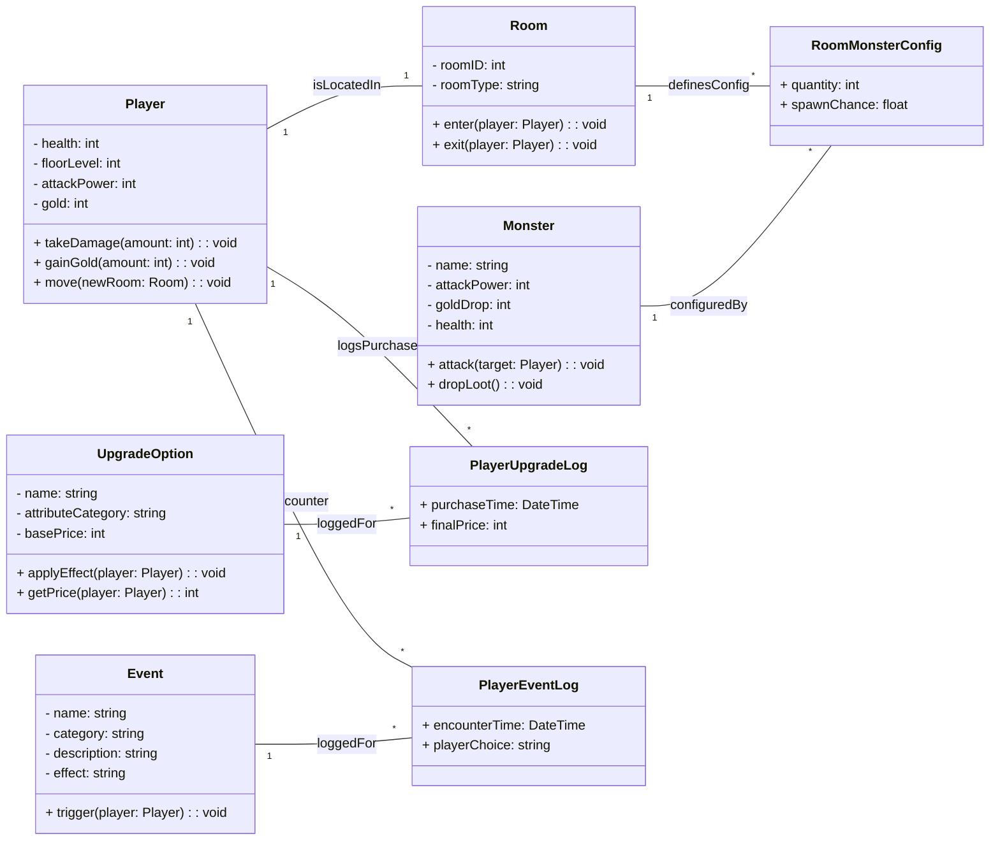
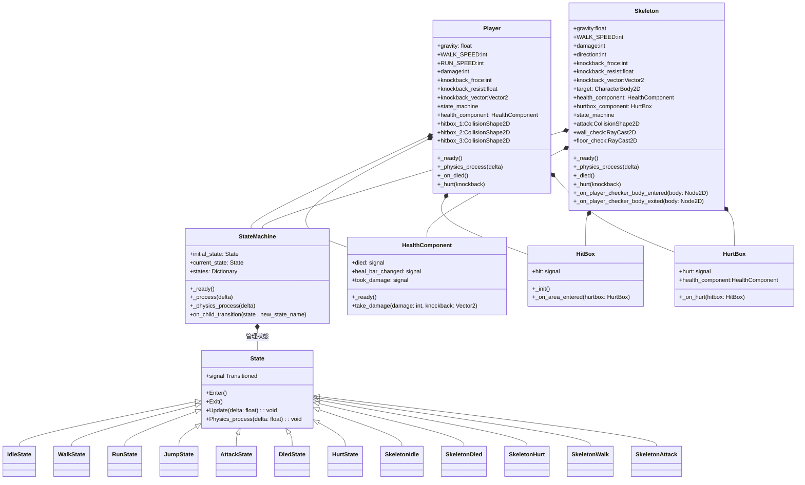
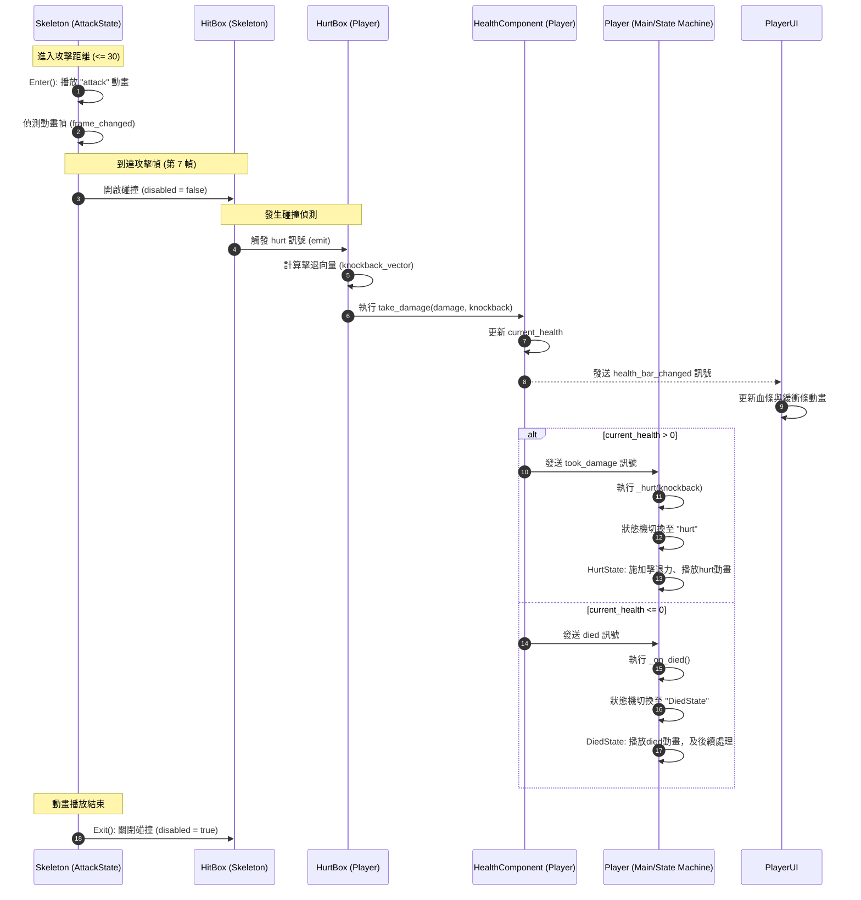
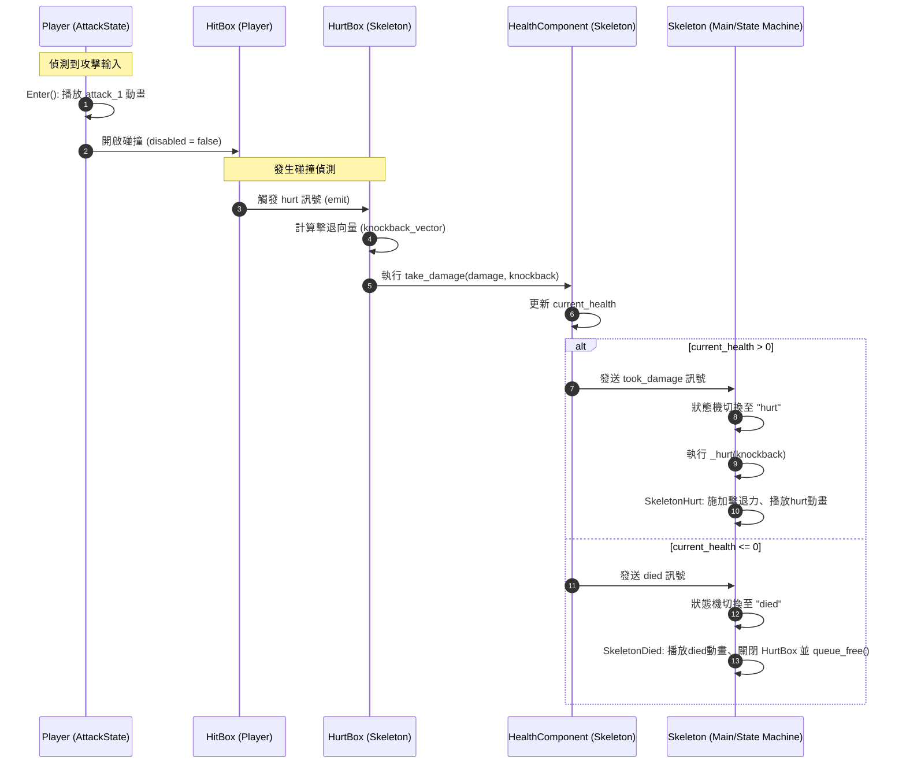

## UML類別圖

```mermaid
classDiagram
    direction LR

    %% Core Classes (核心類別)
    class Player {
        - health: int
        - floorLevel: int
        - attackPower: int
        - gold: int
        + takeDamage(amount: int): void
        + gainGold(amount: int): void
        + move(newRoom: Room): void
    }

    class Room {
        - roomID: int
        - roomType: string
        + enter(player: Player): void
        + exit(player: Player): void
    }

    class UpgradeOption {
        - name: string
        - attributeCategory: string
        - basePrice: int
        + applyEffect(player: Player): void
        + getPrice(player: Player): int
    }

    class Event {
        - name: string
        - category: string
        - description: string
        - effect: string
        + trigger(player: Player): void
    }

    class Monster {
        - name: string
        - attackPower: int
        - goldDrop: int
        - health: int
        + attack(target: Player): void
        + dropLoot(): void
    }

    %% Associative Classes (聯結類別) - for M:N relationships
    class PlayerUpgradeLog {
        + purchaseTime: DateTime
        + finalPrice: int
    }

    class PlayerEventLog {
        + encounterTime: DateTime
        + playerChoice: string
    }

    class RoomMonsterConfig {
        + quantity: int
        + spawnChance: float
    }

    %% Relationships (關係)
    Player "1" -- "1" Room : isLocatedIn
    
    Player "1" -- "*" PlayerUpgradeLog : logsPurchase
    UpgradeOption "1" -- "*" PlayerUpgradeLog : loggedFor

    Player "1" -- "*" PlayerEventLog : logsEncounter
    Event "1" -- "*" PlayerEventLog : loggedFor

    Room "1" -- "*" RoomMonsterConfig : definesConfig
    Monster "1" -- "*" RoomMonsterConfig : configuredBy
```

## 類別圖

```mermaid
classDiagram

    class State {
        +signal Transitioned
        +Enter()
        +Exit()
        +Update(delta: float): void
        +Physics_process(delta: float): void
    }

    class StateMachine {
        +initial_state: State
        +current_state: State
        +states: Dictionary
        +_ready()
        +_process(delta)
        +_physics_process(delta)
        +on_child_transition(state , new_state_name)
    }

    class IdleState {}
    class WalkState {}
    class RunState {}
    class JumpState {}
    class AttackState {}
    class DiedState {}
    class HurtState {}

    class SkeletonIdle {}
    class SkeletonDied {}
    class SkeletonHurt {}
    class SkeletonWalk {}
    class SkeletonAttack {}

    class Player {
        +gravity: float
        +WALK_SPEED:int
        +RUN_SPEED:int
        +damage:int
        +knockback_froce:int
        +knockback_resist:float
        +knockback_vector:Vector2
        +state_machine
        +health_component: HealthComponent
        +hitbox_1:CollisionShape2D
        +hitbox_2:CollisionShape2D
        +hitbox_3:CollisionShape2D
        +_ready()
        +_physics_process(delta)
        +_on_died()
        +_hurt(knockback)

    }

    class Skeleton {
        +gravity:float
        +WALK_SPEED:int
        +damage:int
        +direction:int
        +knockback_froce:int
        +knockback_resist:float
        +knockback_vector:Vector2
        +target: CharacterBody2D
        +health_component: HealthComponent
        +hurtbox_component: HurtBox
        +state_machine
        +attack:CollisionShape2D
        +wall_check:RayCast2D
        +floor_check:RayCast2D
        +_ready()
        +_physics_process(delta)
        +_died()
        +_hurt(knockback)
        +_on_player_checker_body_entered(body: Node2D)
        +_on_player_checker_body_exited(body: Node2D)
    }

    class HealthComponent {
        +died: signal
        +heal_bar_changed: signal
        +took_damage: signal
        +_ready()
        +take_damage(damage: int, knockback: Vector2)
    }

    class HitBox {
        +hit: signal
        +_init()
        +_on_area_entered(hurtbox: HurtBox)
    }

    class HurtBox {
        +hurt: signal
        +health_component:HealthComponent
        +_on_hurt(hitbox: HitBox)
    }

    StateMachine *-- State : 管理狀態


    Player *-- StateMachine
    Skeleton *-- StateMachine
    Player *-- HealthComponent
    Player *-- HitBox
    Player *-- HurtBox
    Skeleton *-- HitBox
    Skeleton *-- HurtBox
    Skeleton *-- HealthComponent

    State <|-- IdleState
    State <|-- WalkState
    State <|-- RunState
    State <|-- JumpState
    State <|-- AttackState
    State <|-- DiedState
    State <|-- HurtState

    State <|-- SkeletonIdle
    State <|-- SkeletonDied
    State <|-- SkeletonHurt
    State <|-- SkeletonWalk
    State <|-- SkeletonAttack
```

## 循序圖-骷髏攻擊玩家

```mermaid
sequenceDiagram
    autonumber
    participant SA as Skeleton (AttackState)
    participant HB as HitBox (Skeleton)
    participant HUB as HurtBox (Player)
    participant HC as HealthComponent (Player)
    participant P as Player (Main/State Machine)
    participant UI as PlayerUI

    Note over SA: 進入攻擊距離 (<= 30)
    SA->>SA: Enter(): 播放 "attack" 動畫
    SA->>SA: 偵測動畫幀 (frame_changed)
    
    Note over SA, HB: 到達攻擊幀 (第 7 幀)
    SA->>HB: 開啟碰撞 (disabled = false)

    Note over HB, HUB: 發生碰撞偵測
    HB->>HUB: 觸發 hurt 訊號 (emit) 
    
    HUB->>HUB: 計算擊退向量 (knockback_vector)
    HUB->>HC: 執行 take_damage(damage, knockback)
    
    HC->>HC: 更新 current_health 
    HC-->>UI: 發送 health_bar_changed 訊號 
    UI->>UI: 更新血條與緩衝條動畫 

    alt current_health > 0
        HC->>P: 發送 took_damage 訊號 
        P->>P: 執行 _hurt(knockback)
        P->>P: 狀態機切換至 "hurt"
        P->>P: HurtState: 施加擊退力、播放hurt動畫
        
    else current_health <= 0
        HC->>P: 發送 died 訊號 
        P->>P: 執行 _on_died()
        P->>P: 狀態機切換至 "DiedState"
        P->>P: DiedState: 播放died動畫，及後續處理
    end

    Note over SA: 動畫播放結束
    SA->>HB: Exit(): 關閉碰撞 (disabled = true)
```

## 循序圖-玩家攻擊骷髏

```mermaid
sequenceDiagram
    autonumber
    participant P as Player (AttackState)
    participant HB as HitBox (Player)
    participant HUB as HurtBox (Skeleton)
    participant HC as HealthComponent (Skeleton)
    participant S as Skeleton (Main/State Machine)

    Note over P: 偵測到攻擊輸入 
    P->>P: Enter(): 播放 attack_1 動畫 
    P->>HB: 開啟碰撞 (disabled = false) 
    
    Note over HB, HUB: 發生碰撞偵測 
    HB->>HUB: 觸發 hurt 訊號 (emit) 
    
    HUB->>HUB: 計算擊退向量 (knockback_vector) 
    HUB->>HC: 執行 take_damage(damage, knockback) 
    
    HC->>HC: 更新 current_health 
     
    
    alt current_health > 0
        HC->>S: 發送 took_damage 訊號 
        S->>S: 狀態機切換至 "hurt" 
        S->>S: 執行 _hurt(knockback)
        S->>S: SkeletonHurt: 施加擊退力、播放hurt動畫
    else current_health <= 0
        HC->>S: 發送 died 訊號 
        S->>S: 狀態機切換至 "died" 
        S->>S: SkeletonDied: 播放died動畫、關閉 HurtBox 並 queue_free() 
    end
```
