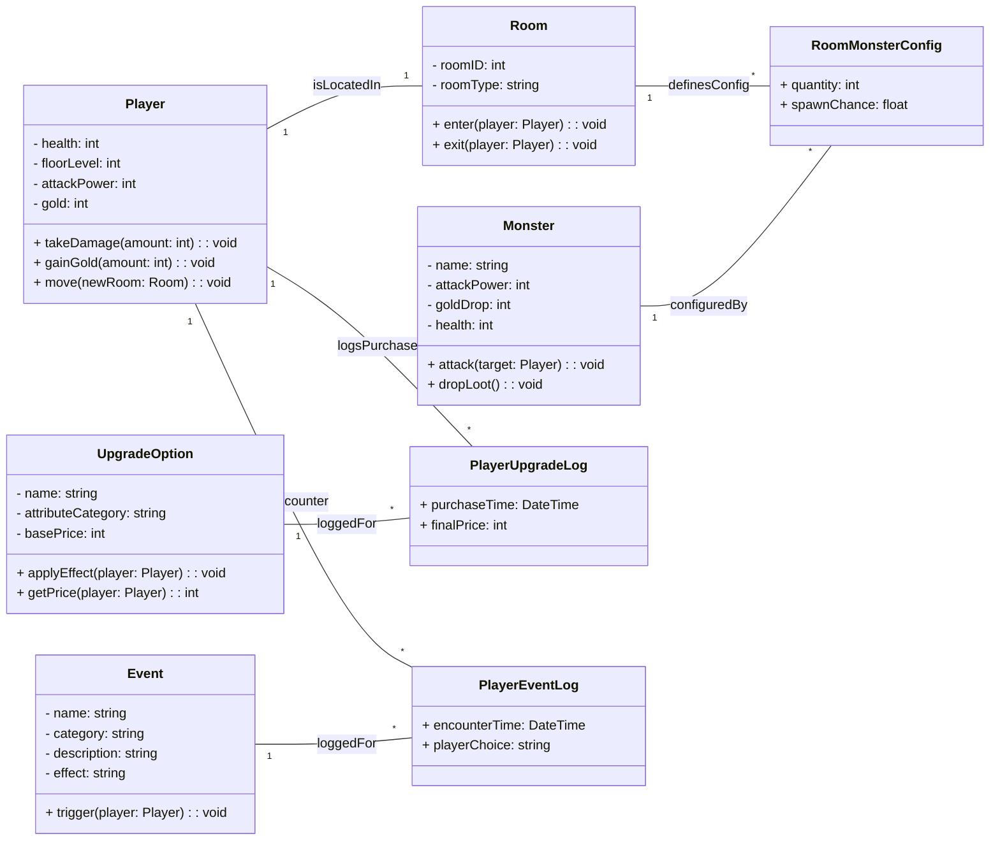

## UML類別圖

```mermaid
classDiagram
    direction LR

    %% Core Classes (核心類別)
    class Player {
        - health: int
        - floorLevel: int
        - attackPower: int
        - gold: int
        + takeDamage(amount: int): void
        + gainGold(amount: int): void
        + move(newRoom: Room): void
    }

    class Room {
        - roomID: int
        - roomType: string
        + enter(player: Player): void
        + exit(player: Player): void
    }

    class UpgradeOption {
        - name: string
        - attributeCategory: string
        - basePrice: int
        + applyEffect(player: Player): void
        + getPrice(player: Player): int
    }

    class Event {
        - name: string
        - category: string
        - description: string
        - effect: string
        + trigger(player: Player): void
    }

    class Monster {
        - name: string
        - attackPower: int
        - goldDrop: int
        - health: int
        + attack(target: Player): void
        + dropLoot(): void
    }

    %% Associative Classes (聯結類別) - for M:N relationships
    class PlayerUpgradeLog {
        + purchaseTime: DateTime
        + finalPrice: int
    }

    class PlayerEventLog {
        + encounterTime: DateTime
        + playerChoice: string
    }

    class RoomMonsterConfig {
        + quantity: int
        + spawnChance: float
    }

    %% Relationships (關係)
    Player "1" -- "1" Room : isLocatedIn
    
    Player "1" -- "*" PlayerUpgradeLog : logsPurchase
    UpgradeOption "1" -- "*" PlayerUpgradeLog : loggedFor

    Player "1" -- "*" PlayerEventLog : logsEncounter
    Event "1" -- "*" PlayerEventLog : loggedFor

    Room "1" -- "*" RoomMonsterConfig : definesConfig
    Monster "1" -- "*" RoomMonsterConfig : configuredBy
```

## 類別圖

```mermaid
classDiagram

    class State {
        +signal Transitioned
        +Enter()
        +Exit()
        +Update(delta: float): void
        +Physics_process(delta: float): void
    }

    class StateMachine {
        +initial_state: State
        +current_state: State
        +states: Dictionary
        +_ready()
        +_process(delta)
        +_physics_process(delta)
        +on_child_transition(state , new_state_name)
    }

    class IdleState {}
    class WalkState {}
    class RunState {}
    class JumpState {}
    class AttackState {}
    class DiedState {}
    class HurtState {}

    class SkeletonIdle {}
    class SkeletonDied {}
    class SkeletonHurt {}
    class SkeletonWalk {}
    class SkeletonAttack {}

    class Player {
        +gravity: float
        +WALK_SPEED:int
        +RUN_SPEED:int
        +damage:int
        +knockback_froce:int
        +knockback_resist:float
        +knockback_vector:Vector2
        +state_machine
        +health_component: HealthComponent
        +hitbox_1:CollisionShape2D
        +hitbox_2:CollisionShape2D
        +hitbox_3:CollisionShape2D
        +_ready()
        +_physics_process(delta)
        +_on_died()
        +_hurt(knockback)

    }

    class Skeleton {
        +gravity:float
        +WALK_SPEED:int
        +damage:int
        +direction:int
        +knockback_froce:int
        +knockback_resist:float
        +knockback_vector:Vector2
        +target: CharacterBody2D
        +health_component: HealthComponent
        +hurtbox_component: HurtBox
        +state_machine
        +attack:CollisionShape2D
        +wall_check:RayCast2D
        +floor_check:RayCast2D
        +_ready()
        +_physics_process(delta)
        +_died()
        +_hurt(knockback)
        +_on_player_checker_body_entered(body: Node2D)
        +_on_player_checker_body_exited(body: Node2D)
    }

    class HealthComponent {
        +died: signal
        +heal_bar_changed: signal
        +took_damage: signal
        +_ready()
        +take_damage(damage: int, knockback: Vector2)
    }

    class HitBox {
        +hit: signal
        +_init()
        +_on_area_entered(hurtbox: HurtBox)
    }

    class HurtBox {
        +hurt: signal
        +health_component:HealthComponent
        +_on_hurt(hitbox: HitBox)
    }

    StateMachine *-- State : 管理狀態


    Player *-- StateMachine
    Skeleton *-- StateMachine
    Player *-- HealthComponent
    Player *-- HitBox
    Player *-- HurtBox
    Skeleton *-- HitBox
    Skeleton *-- HurtBox
    Skeleton *-- HealthComponent

    State <|-- IdleState
    State <|-- WalkState
    State <|-- RunState
    State <|-- JumpState
    State <|-- AttackState
    State <|-- DiedState
    State <|-- HurtState

    State <|-- SkeletonIdle
    State <|-- SkeletonDied
    State <|-- SkeletonHurt
    State <|-- SkeletonWalk
    State <|-- SkeletonAttack
```
