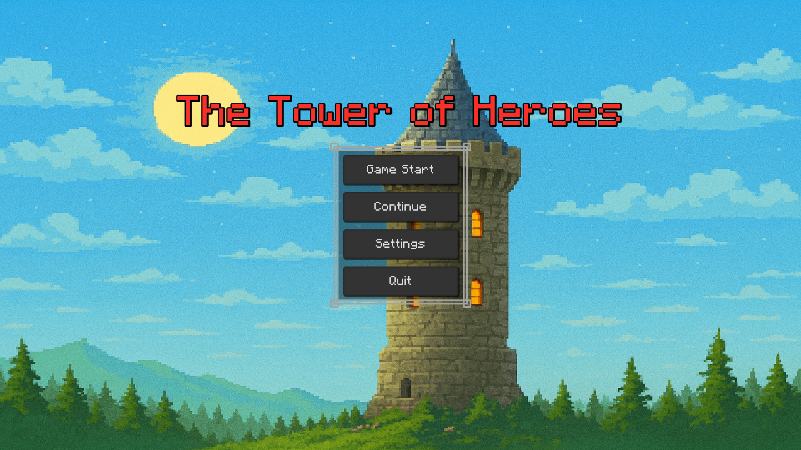
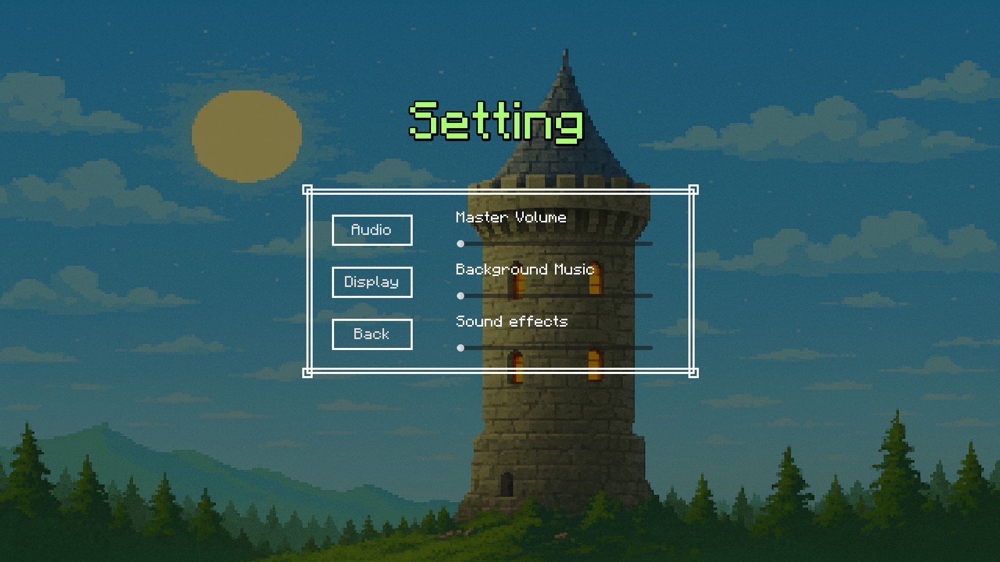
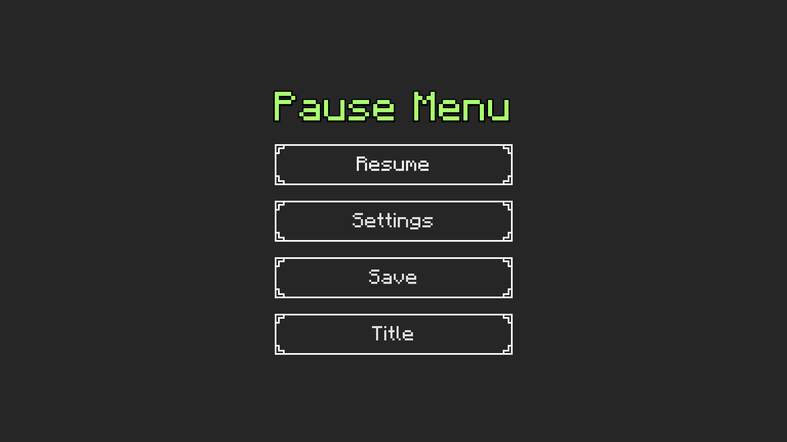
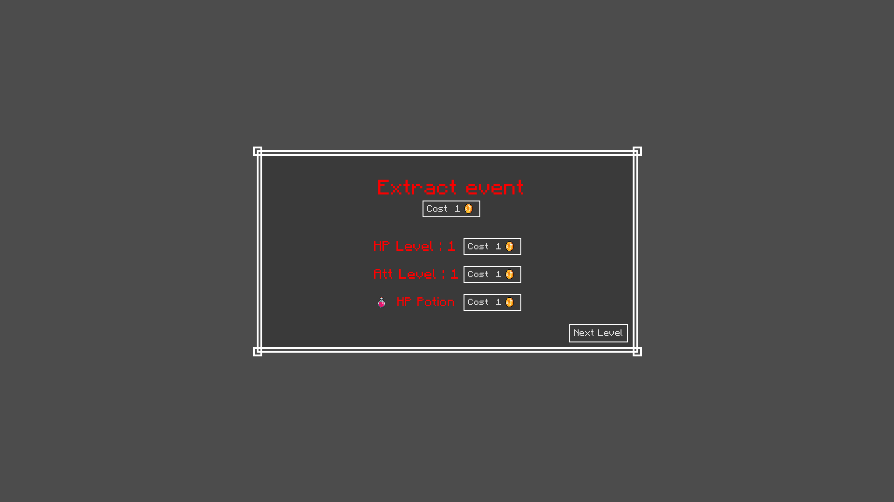
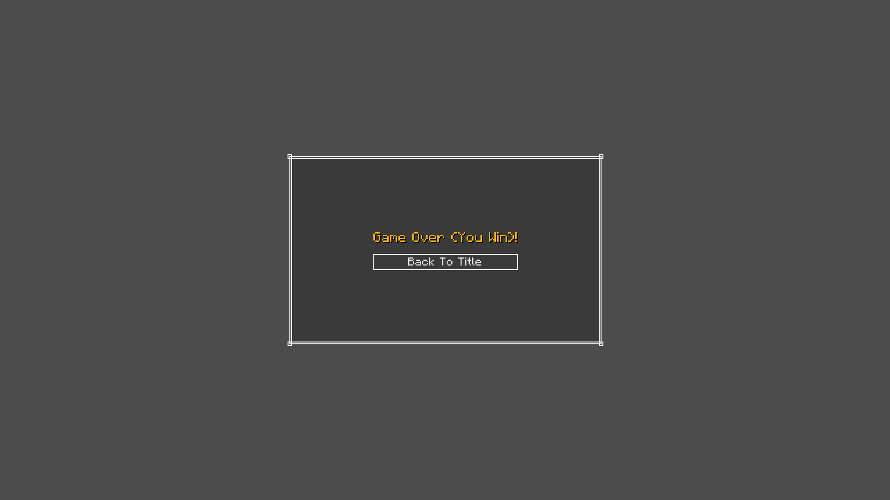
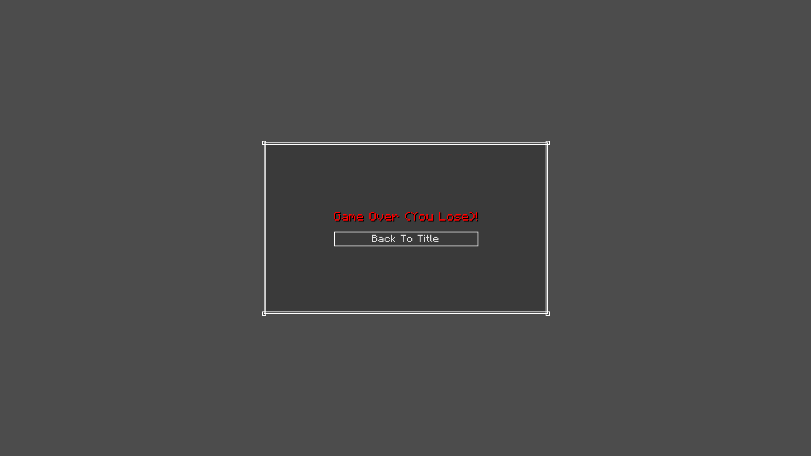
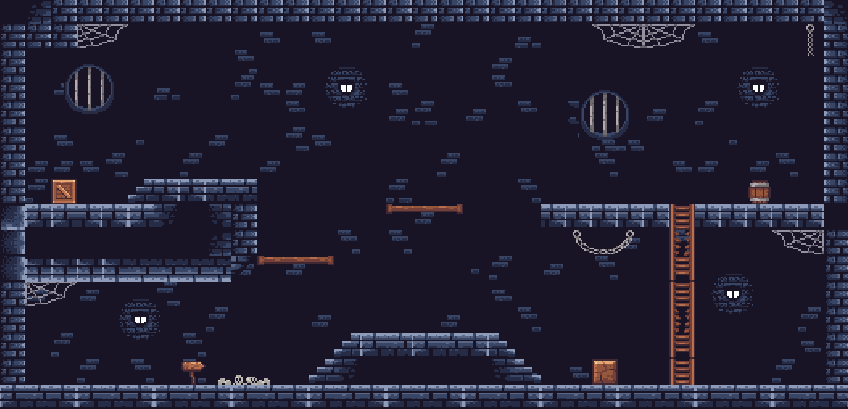
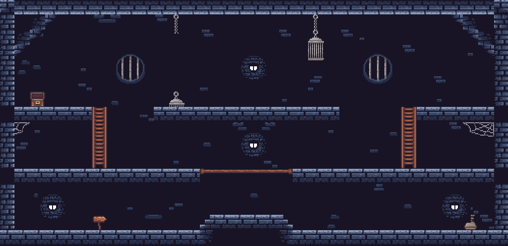
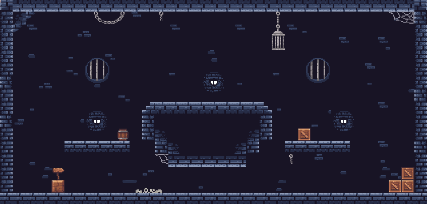
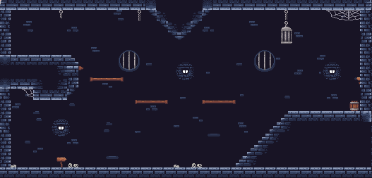

# 流程圖

- :字太小的話可以點進去看

# 分鏡圖
### 遊戲主選單

- 開始遊戲:進入遊戲關卡
- 繼續遊戲:從上一次的地方遊玩
- 設定:進入設定選單
- 離開:退出遊戲

### ⚙️ 設定選單

- 🎵Audio:這裡可以切換到音量設定
- 🎵Master Volume:拉動滑條調整遊戲主音量
- 🎵Background Music:拉動滑條調整背景音樂
- 🎵Sound effects:拉動滑條調整音效
- 🖥️Display:這裡可以切換到畫面設定
- 🖥️Windows Mode:調整視窗大小(目前僅供Fullscreen和Windows選項)
- 🖥️fps:調整遊戲FPS(目前僅供30、60、120、240選項)
- 🖥️Vsync:垂直同步選項，打勾即可開啟

### ⏸️暫停畫面(遊戲中按下ESc鍵跳出)

- 🔙Resume:返回遊戲
- 📁Save:存儲當前遊戲進度
- ⚙️Setting:進入設定選單
- Title:回到遊戲主選單

### 🛒當前樓層通關畫面(類似商店)

- Random Event:隨機抽取下關的隨機事件，預設會抽一個，可按下方按鈕花費金幣再次抽取(金幣消耗隨抽取次數遞增)
- HP Level:消耗金幣提升HP等級(金幣消耗隨抽取次數遞增)
- Att Level:消耗金幣提升攻擊力(金幣消耗隨抽取次數遞增)
- HP Potion:消耗金幣購買補血藥
- NextLevel:進入下一關的按鈕

### 🔚遊戲結束畫面(分為通關和死亡)

- 🔙Back Title:回到主畫面

### 遊戲會用到的關卡場景(目前共四間，進入關卡隨機一間)

