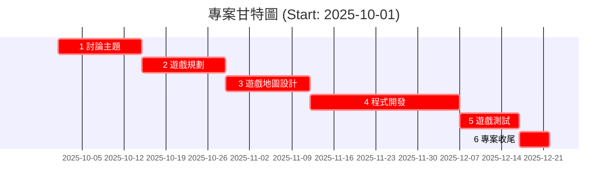

# 2D平台遊戲專案時間表

| 時間 | 任務 | 說明 |
|------|------|------|
| 10/1 – 10/14 | 討論主題 | 概念設計與核心方向討論 |
| 10/15 – 10/28 | 遊戲規劃 | 撰寫GDD、確定功能、分配素材與工作 |
| 10/29 – 11/11 | 遊戲地圖設計 | 繪製地圖草圖、設計關卡、放置敵人/道具 |
| 11/12 – 12/6 | 程式開發 | 建立角色控制、關卡系統、敵人、UI整合 |
| 12/7 – 12/16 | 遊戲測試 | 功能測試、遊戲能成功運行到結束 |
| 12/17 – 12/21 | 專案收尾 | 完成最終版本、整理報告 |


```mermaid

graph TD
  A1["1. 討論主題 (14d)"]
  A2["2. 遊戲規劃 (14d)"]
  A3["3. 遊戲地圖設計 (14d)"]
  A4["4. 程式開發 (25d)"]
  A5["5. 遊戲測試 (10d)"]
  A6["6. 專案收尾 (5d)"]

 A1 --> A2
  A2 --> A3
  A3 --> A4
  A4 --> A5
  A5 --> A6
