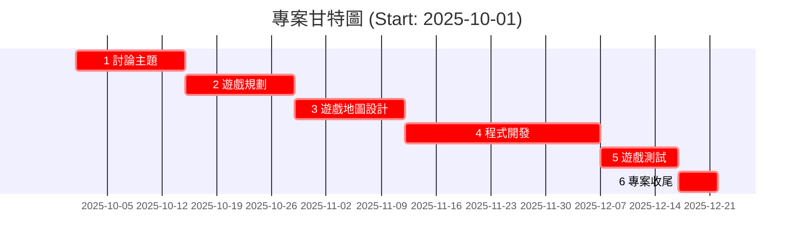

# 2D平台遊戲專案時間表

| 時間 | 任務 |
|------|------|
| 10/1 – 10/14 | 討論主題 |
| 10/15 – 10/28 | 遊戲規劃 |
| 10/29 – 11/11 | 遊戲地圖設計 |
| 11/12 – 12/6 | 程式開發 |
| 12/7 – 12/16 | 遊戲測試 |
| 12/17 – 12/21 | 專案收尾 |

## 工作項目分解(WBS)
### 1. 討論主題（10/1 – 10/14）
- 1.1 蒐集遊戲題材與靈感  
- 1.2 討論遊戲類型（平台、射擊、解謎等）  
- 1.3 決定遊戲主題與遊戲機制  
- 1.4 確立團隊分工  

---
### 2. 遊戲規劃（10/15 – 10/28）
- 2.1 撰寫遊戲企劃書（GDD）  
- 2.2 設定遊戲目標  
- 2.3 定義角色、敵人、道具、關卡數量  
- 2.4 規劃介面 (UI)、音效及動畫需求    

---

### 3. 遊戲地圖設計（10/29 – 11/11）
- 3.1 設計關卡草圖
- 3.2 繪製遊戲關卡  
- 3.3 放置背景與地形物件  
- 3.4 放置角色、敵人與拾取物件      

---

### 4. 程式開發（11/12 – 12/6）
- 4.1.1 建立遊戲主架構（主選單、關卡切換）  
- 4.1.2 撰寫角色控制（移動、跳躍、攻擊、翻滾）  
- 4.1.3 敵人 AI 與碰撞判定  
- 4.1.4 加入遊戲物理、分數系統、UI 介面  
- 4.1.5 整合音效與動畫    

---
### 5. 遊戲測試（12/7 – 12/16）
- 5.1.1 功能測試（是否有 Bug）  
- 5.1.2 關卡難度與平衡測試  
- 5.1.3 使用者體驗測試（操作順暢度）  
- 5.1.4 修正與優化  

---

### 6. 專案收尾（12/17 – 12/21）
- 6.1.1 撰寫報告或簡報  
- 6.1.2 最終遊戲封裝與上傳  
- 6.1.3 小組成果展示

## 工作分配
| 工作 | 負責組員 |
|------|------|
| 討論主題 | 全員 |
| 遊戲規劃 | 全員 |
| 遊戲地圖設計 | 黃宇翔 |
| 程式開發 | 陳書緯 |
| 遊戲測試 | 黃宇翔|


## 甘特圖

```mermaid


graph TD
  A1["1. 討論主題 (14d)"]
  A2["2. 遊戲規劃 (14d)"]
  A3["3. 遊戲地圖設計 (14d)"]
  A4["4. 程式開發 (25d)"]
  A5["5. 遊戲測試 (10d)"]
  A6["6. 專案收尾 (5d)"]

 A1 --> A2
  A2 --> A3
  A3 --> A4
  A4 --> A5
  A5 --> A6
