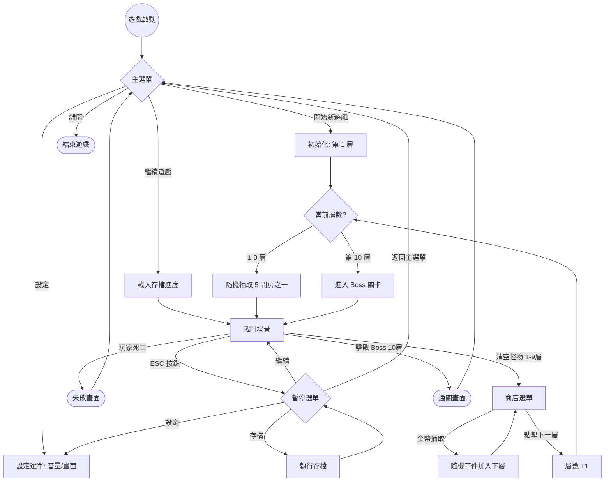

## 遊戲流程圖

```mermaid
graph TD
    %% 1. 主選單入口
    Start((遊戲啟動)) --> MainMenu{主選單}
    
    MainMenu -->|開始新遊戲| NewGame[初始化: 第 1 層]
    MainMenu -->|繼續遊戲| LoadGame[載入存檔進度]
    MainMenu -->|設定| Settings[設定選單: 音量/畫面]
    MainMenu -->|離開| Exit([結束遊戲])

    %% 2. 爬塔核心循環
    NewGame --> LevelLogic
    LoadGame --> Combat

    LevelLogic{當前層數?}
    LevelLogic -->|1-9 層| RandomMap[隨機抽取 5 間房之一]
    LevelLogic -->|第 10 層| BossMap[進入 Boss 關卡]

    %% 3. 戰鬥與互動
    RandomMap --> Combat[戰鬥場景]
    BossMap --> Combat

    Combat -->|ESC 按鍵| PauseMenu{暫停選單}
    PauseMenu -->|繼續| Combat
    PauseMenu -->|設定| Settings
    PauseMenu -->|存檔| Save[執行存檔] --> PauseMenu
    PauseMenu -->|返回主選單| MainMenu

    %% 4. 戰鬥結果分支
    Combat -->|玩家死亡| Fail([失敗畫面]) --> MainMenu
    
    Combat -->|清空怪物 1-9層| Shop[商店選單]
    Shop -->|金幣抽取| RandomEvent[隨機事件加入下層]
    RandomEvent --> Shop
    Shop -->|點擊下一層| NextLevel[層數 +1] --> LevelLogic

    Combat -->|擊敗 Boss 10層| Win([通關畫面]) --> MainMenu
```
